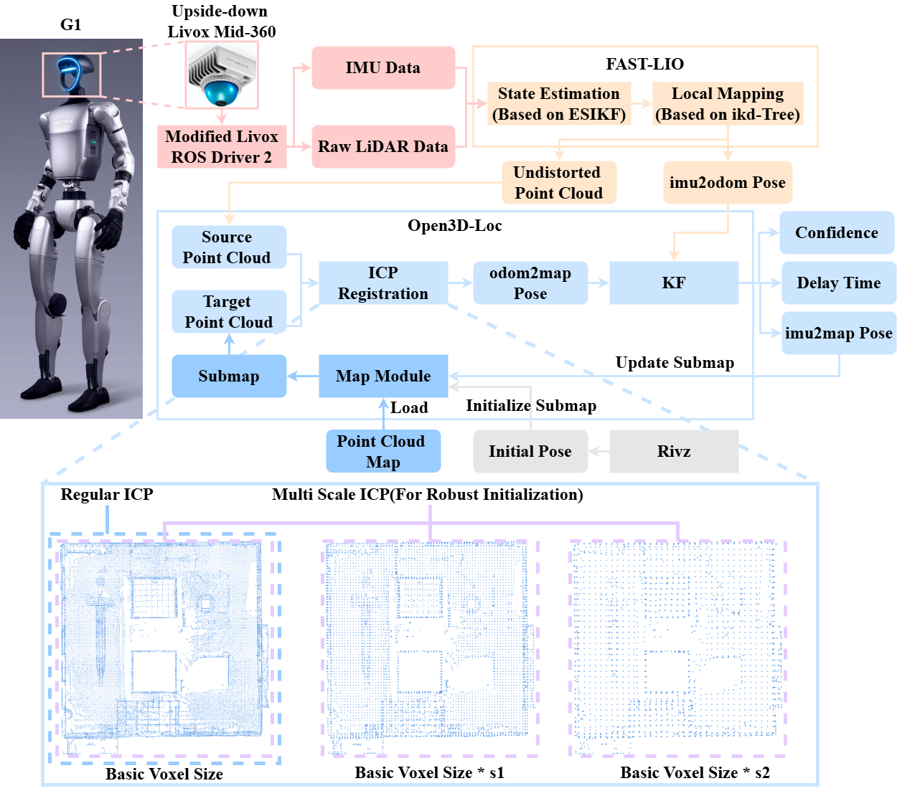
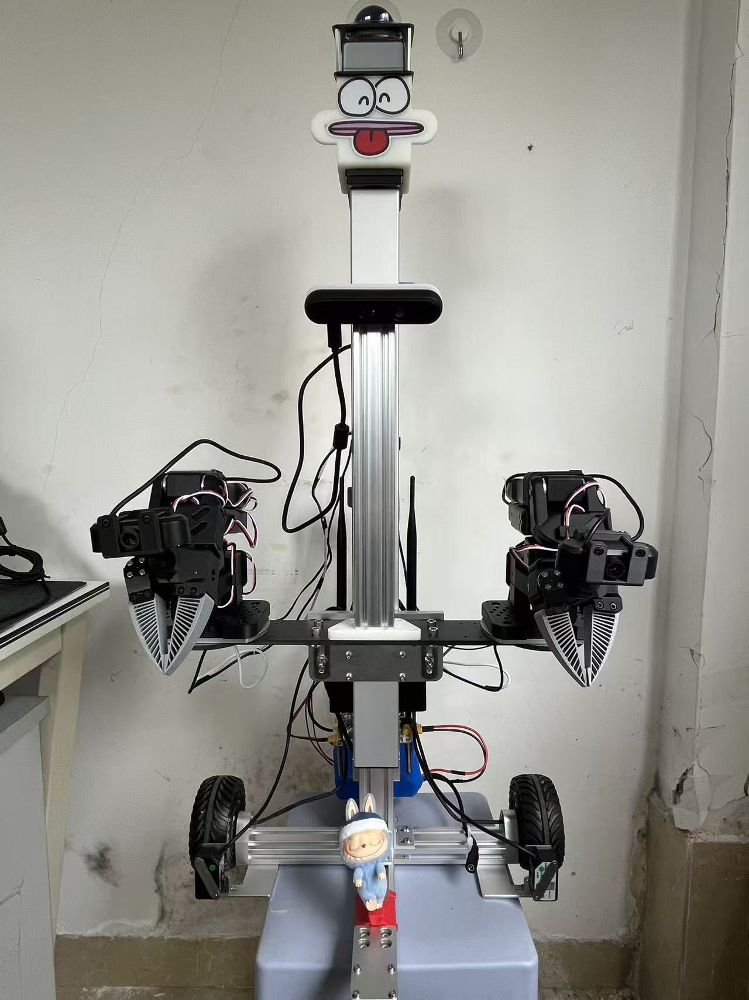
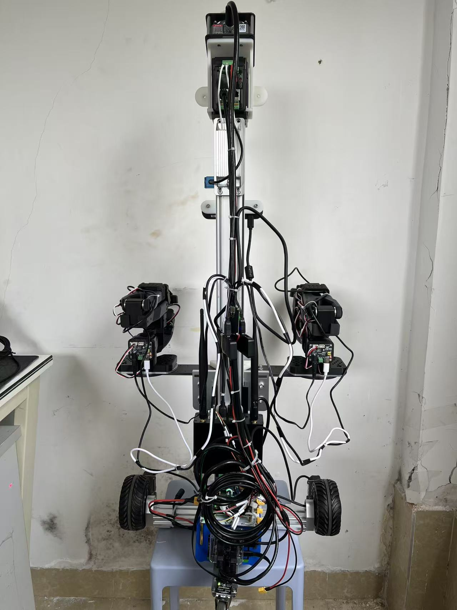

# 家庭服务机器人
## 1.项目介绍
主控基于Jetson orin nano super8G;导航基于Mid360s;机械臂基于huggingface的lerobot;PCB与CNC来源立创免费打样。
## 2.使用说明
可结合本人blibli此系列视频进行操作(未更新)，视频链接：[家庭服务机器人全栈怒挫中](https://www.bilibili.com/video/BV1C8AGzwE5Z?vd_source=956043e91d9fa045c1e7c746411b5102)  
借鉴项目(现在已完成全部环境部署运行，导航完成，遥操训练正在制作，零件等全由本人DIY )：  
- 建图算法：fast_lio2_ros2：[https://github.com/Ericsii/FAST_LIO_ROS2?tab=readme-ov-file](https://github.com/Ericsii/FAST_LIO_ROS2?tab=readme-ov-file)
- 定位算法：FAST_LIO_LOCALIZATION_HUMANOID：[https://github.com/deepglint/FAST_LIO_LOCALIZATION_HUMANOID/tree/humble#](https://github.com/deepglint/FAST_LIO_LOCALIZATION_HUMANOID/tree/humble#)
- 机械臂：双臂lerobot：[https://github.com/lerobot/lerobot](https://github.com/lerobot/lerobot)
## 3.🤔🤔🤔算法核心
### 3.1 建图算法：FAST-LIO 2.0 (2021-07-05 Update)

**相关视频:**  [FAST-LIO2](https://youtu.be/2OvjGnxszf8),  [FAST-LIO1](https://youtu.be/iYCY6T79oNU)

**流程:**

**新功能:**
1. 利用[ikd-Tree](https://github.com/hku-mars/ikd-Tree)进行增量映射，实现更快的速度和超过 100Hz 的激光雷达速率。
2. 对原始激光雷达点进行直接里程测量（扫描到地图）（可禁用特征提取），实现更高精度。
3. 由于无需特征提取，FAST-LIO2 支持多种类型的激光雷达，包括旋转激光雷达（Velodyne、Ouster）和固态激光雷达（Livox Avia、Horizon、MID-70），并且可以轻松扩展以支持更多激光雷达。
4. 支持外部IMU。
5. 支持基于ARM的平台，如Khadas VIM3、Nivida TX2、Raspberry Pi 4B（8G RAM）。
### 3.2 定位算法：FAST_LIO_LOCALIZATION_HUMANOID
**流程:**

**基于离线点云地图的稳健本地化**  
此解决方案能够处理**粗略的初始姿态** ，支持**稳健的定位** ，并且离线点云地图保证不会因长时间工作而**累积的定位误差**（不同于常见的 SLAM）。彩色点云的可视化效果更好。

## 4.安装依赖与编译项目

## 5.实物图片📸 📸 
- 实物(仍在完善优化)  

  
  

## 6.📩作者
- [Luckme921](https://github.com/Luckme921)
- **邮箱**：1814313359@qq.com